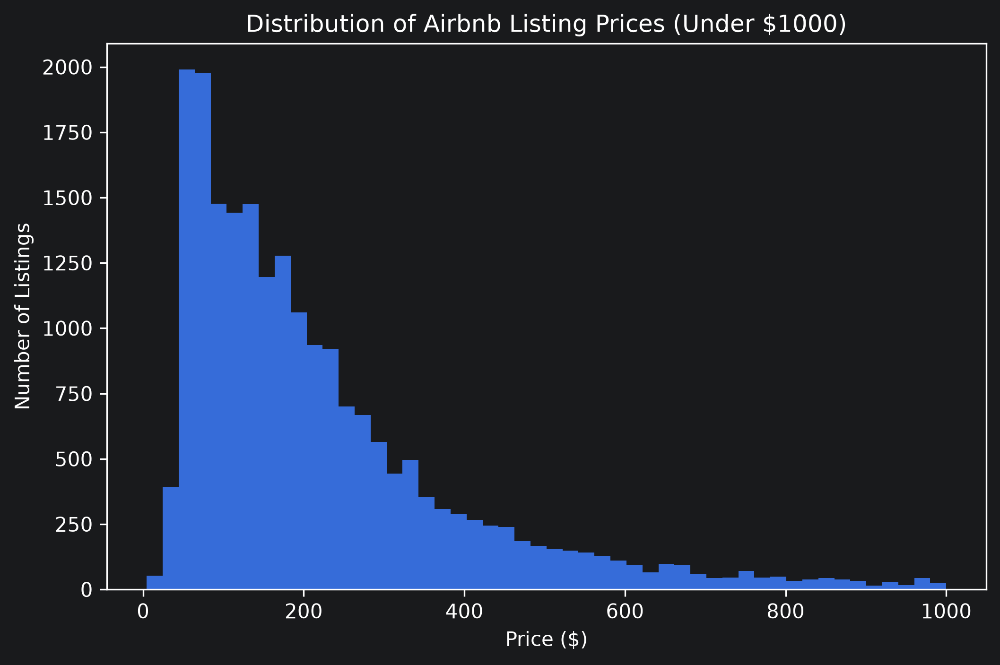
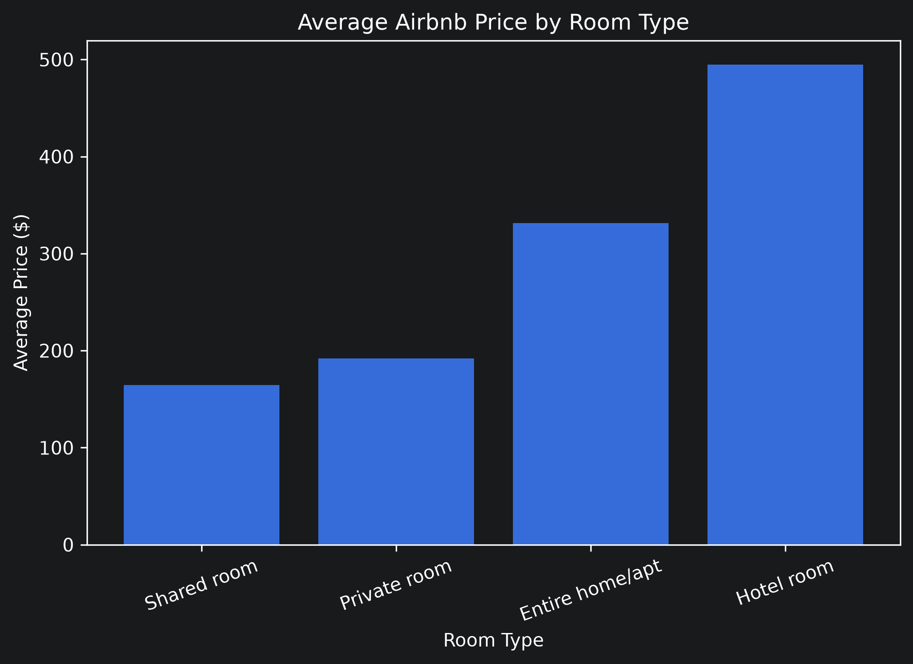
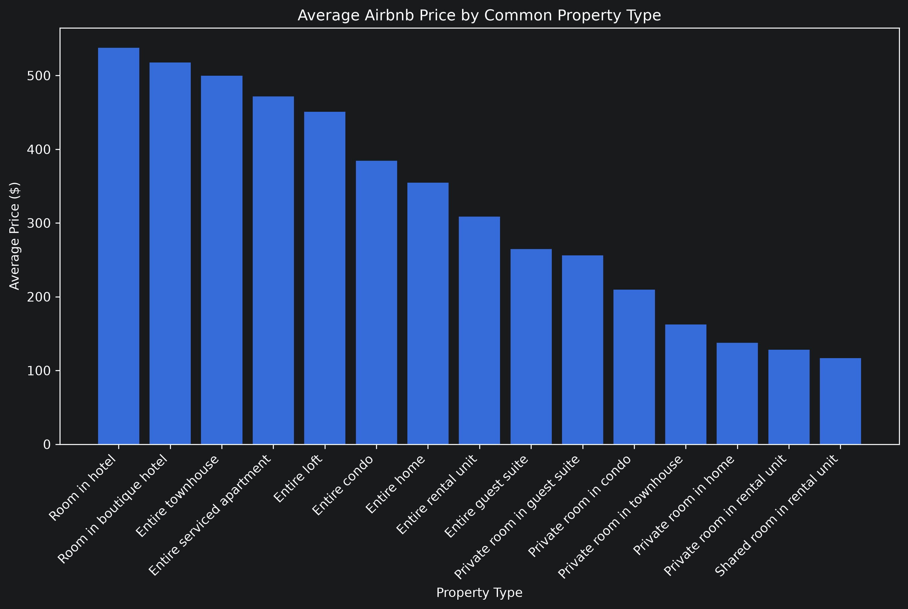
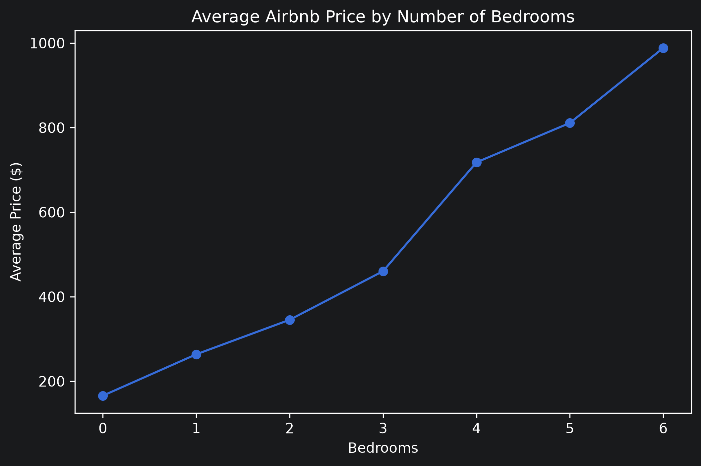
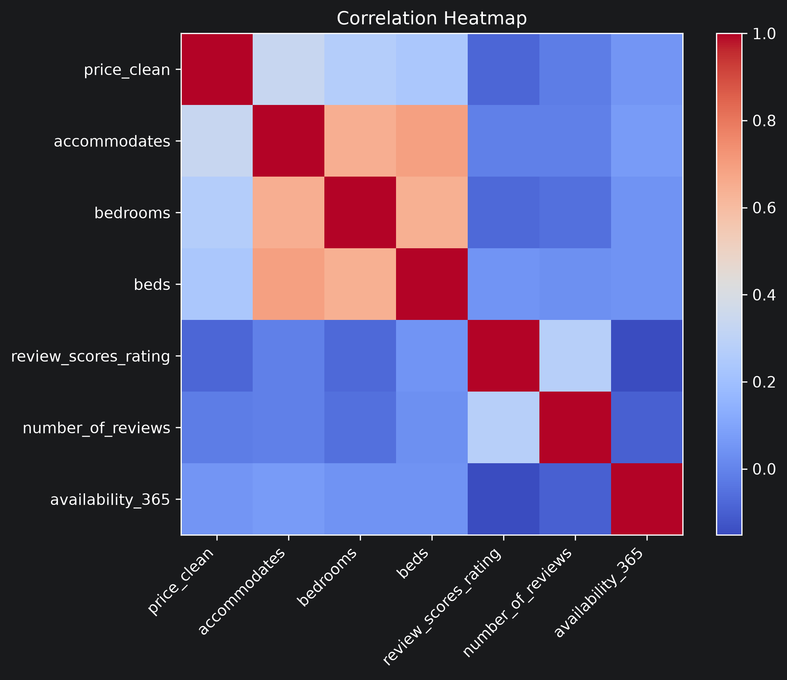
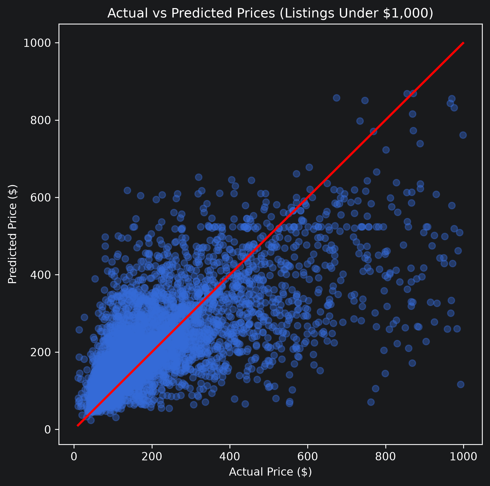

# Airbnb Revenue Analysis

A machine learning project that predicts Airbnb listing prices using property characteristics and review data. This project walks through a complete data science workflow, from data cleaning and exploratory analysis to feature engineering and predictive modeling.

## Project Overview

The goal of this project is to analyze factors that influence Airbnb listing prices and build regression models capable of predicting listing revenue.

The project includes:

- Data cleaning
- Exploratory data analysis (EDA)
- Feature engineering
- Machine learning modeling
- Model evaluation

---
## Results

- Best model: Random Forest
- Mean Absolute Error (MAE): $86.04
- RMSE: $129.63
- R² Score: 0.466
---
## Technologies Used

- Python
- Pandas
- NumPy
- Matplotlib
- Scikit-learn
- Jupyter Notebook

---

## Project Structure

```
airbnb-revenue-analysis/
│
├── data/
├── images/
├── notebooks/
│   ├── 01_data_understanding.ipynb
│   ├── 02_data_cleaning.ipynb
│   ├── 03_exploratory_data_analysis.ipynb
│   ├── 04_feature_engineering.ipynb
│   └── 05_modeling.ipynb
│
└── README.md
```

---

## Exploratory Data Analysis

### Distribution of Airbnb Listing Prices



Most Airbnb listings are priced below \$300 per night, with relatively few high-priced luxury properties.

---

### Average Price by Room Type



Entire homes command significantly higher nightly prices than private or shared rooms.

---

### Average Price by Property Type



Property type has a noticeable impact on average listing price.

---

### Average Price by Number of Bedrooms



Listings with more bedrooms generally have higher nightly prices.

---

### Correlation Heatmap



The heatmap highlights relationships between numerical features used during modeling.

---

## Machine Learning

Two regression models were trained:

- Linear Regression
- Random Forest Regressor

The models were evaluated using:

- Mean Absolute Error (MAE)
- Root Mean Squared Error (RMSE)
- R² Score

Extreme luxury listings were removed in a second experiment to improve predictive performance.

### Final Model Results (Listings Under $1,000)

| Model | MAE | RMSE | R² |
| --- | ---: | ---: | ---: |
| Linear Regression | 98.68 | 141.87 | 0.360 |
| Random Forest | 86.04 | 129.63 | 0.466 |

---

### Random Forest Predictions



The Random Forest model produced the strongest performance, capturing pricing patterns more effectively than Linear Regression after filtering out extreme outliers.

---

## Key Findings

- Entire homes are considerably more expensive than private or shared rooms.
- Listings with additional bedrooms generally command higher prices.
- Property type influences nightly rates.
- Removing luxury outliers significantly improved model accuracy.
- Random Forest outperformed Linear Regression across all evaluation metrics.

---

## Future Improvements

- Hyperparameter tuning
- Cross-validation
- Gradient Boosting or XGBoost
- Geographic feature engineering
- Additional host and amenity features
